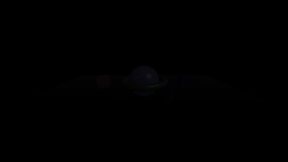

# Multi-Object Scene

A complex 3D scene demonstrating multiple objects with different geometries, materials, and coordinated animations.

## Preview



[View full video (video.mp4)](./video.mp4)

## Features

- 8 different mesh objects with 5 geometry types
- Multiple material variations (metalness, roughness, emissive)
- Four-light setup with colored accent lights
- Real-time soft shadows
- Atmospheric fog effect
- Coordinated auto-rotation animations
- Professional UI overlay

## Usage

```bash
pnpm run examples:render 3d/multi-object-scene
```

## Scene Composition

### Geometry Types Used

1. **Sphere** (center) - Main focal point with emissive glow
2. **Box** (2x) - Rotating cubes on left and right
3. **Torus** - Ring orbiting the center sphere
4. **Cone** - Rotating cone in the background
5. **Cylinder** (2x) - Pillars in the foreground
6. **Plane** - Floor receiving shadows

### Object Details

**Center Sphere:**
- High-poly sphere (64x32 segments)
- Metallic material with emissive purple glow
- Slow Y-axis rotation (0.008 rad/frame)

**Side Cubes:**
- Counter-rotating on multiple axes
- Red (left) and blue (right) colors
- Match accent light colors

**Torus Ring:**
- Orbits horizontally around center
- Green metallic material
- 2-unit radius with 0.3 tube

**Background Cone:**
- Yellow/gold material
- Fast Y-axis rotation
- Positioned at z=-4

**Foreground Cylinders:**
- Tapered cylinders (top smaller than bottom)
- Metallic finish
- Counter-rotating

**Floor:**
- Large 30x30 plane
- Dark material
- Receives all shadows

### Lighting Setup

1. **Ambient Light**
   - Base illumination (intensity: 0.4)
   - Prevents completely dark areas

2. **Key Light** (Directional)
   - Main light source
   - Position: [8, 10, 6]
   - Casts soft shadows

3. **Red Accent Light** (Point)
   - Left side accent
   - Position: [-4, 4, 4]
   - Illuminates left cube

4. **Blue Accent Light** (Point)
   - Right side accent
   - Position: [4, 4, 4]
   - Illuminates right cube

### Special Effects

**Fog:**
- Dark purple fog (matches gradient background)
- Starts at distance 8
- Fully obscures at distance 25
- Creates depth and atmosphere

**Shadows:**
- PCF Soft shadows (smooth edges)
- 2048x2048 shadow map (high quality)
- All objects cast and receive shadows

**Tone Mapping:**
- ACES Filmic for cinematic look
- Standard exposure (1.0)

## Technical Details

- **Duration:** 10 seconds at 30fps (300 frames)
- **Resolution:** 1920x1080 (Full HD)
- **Total Meshes:** 8 (7 objects + floor)
- **Lights:** 4 (1 ambient + 1 directional + 2 point)
- **Shadows:** Enabled (PCF Soft)
- **Fog:** Enabled

## Customization Ideas

### Add More Objects

```json
{
  "id": "new-sphere",
  "geometry": {
    "type": "sphere",
    "radius": 0.5
  },
  "material": {
    "type": "standard",
    "color": "#00ff00"
  },
  "position": [0, 3, 0],
  "autoRotate": [0.02, 0, 0]
}
```

### Change Animation Speeds

Modify `autoRotate` values:
```json
"autoRotate": [0.03, 0.04, 0.02]  // Faster
"autoRotate": [0.005, 0.01, 0]    // Slower
```

### Different Material Looks

Glass effect:
```json
"material": {
  "type": "physical",
  "transmission": 1,
  "thickness": 0.5,
  "roughness": 0
}
```

Wireframe mode:
```json
"material": {
  "type": "standard",
  "color": "#ffffff",
  "wireframe": true
}
```

### Adjust Fog

Thicker fog:
```json
"fog": {
  "color": "#2d2d3a",
  "near": 5,
  "far": 15
}
```

No fog:
```json
// Remove fog property entirely
```

### Change Camera Angle

Side view:
```json
"camera": {
  "type": "perspective",
  "fov": 75,
  "position": [10, 3, 0],
  "lookAt": [0, 0, 0]
}
```

Top-down view:
```json
"camera": {
  "type": "perspective",
  "fov": 75,
  "position": [0, 15, 0],
  "lookAt": [0, 0, 0]
}
```

## Animation Breakdown

### Rotation Patterns

Objects use different rotation patterns for visual interest:

- **Center Sphere:** Slow single-axis (creates calm center)
- **Side Cubes:** Multi-axis counter-rotation (dynamic)
- **Torus:** Medium Y-axis (smooth orbit feel)
- **Cone:** Fast Y-axis (energetic)
- **Cylinders:** Multi-axis counter to each other (symmetry)

### Timing

| Element | Entrance Delay | Duration | Effect |
|---------|---------------|----------|--------|
| Scene | 0 | 30 frames | Fade in |
| Title | 15 frames | 25 frames | Slide down |
| Subtitle | 35 frames | 20 frames | Fade in |
| Feature box | 60 frames | 25 frames | Slide left |
| Features text | 70 frames | 20 frames | Fade in |

## Performance Considerations

This is a complex scene with many objects. Optimization tips:

1. **Reduce Geometry Detail:**
   ```json
   "widthSegments": 32,  // Instead of 64
   "heightSegments": 16  // Instead of 32
   ```

2. **Lower Shadow Quality:**
   ```json
   "shadowMapSize": 1024  // Instead of 2048
   ```

3. **Simplify Materials:**
   Use `standard` instead of `physical` where possible

4. **Disable Fog:**
   Remove fog property if not needed

5. **Reduce Object Count:**
   Remove less important objects

## Color Palette

The scene uses a cohesive color palette:

- **Background:** Purple gradient (#667eea → #764ba2)
- **Center:** White with purple emissive
- **Accents:** Red (#ff6b6b) and Blue (#4c00ff)
- **Supporting:** Green (#51cf66) and Yellow (#ffd43b)
- **Environment:** Dark purple (#2d2d3a)

## Related Examples

- [Basic Rotating Cube](/examples/3d/basic-rotating-cube/) - Simple single object
- [Product Showcase](/examples/3d/product-showcase/) - Studio lighting
- [Text 3D](/examples/3d/text-3d/) - 3D text rendering

## Learning Points

This example demonstrates:

1. **Composition:** Arranging multiple objects in 3D space
2. **Hierarchy:** Creating focal points and supporting elements
3. **Lighting:** Multi-light setups with colored accents
4. **Animation:** Coordinating multiple object animations
5. **Atmosphere:** Using fog for depth and mood
6. **Materials:** Variety of PBR material settings
7. **Performance:** Balancing quality vs render time
