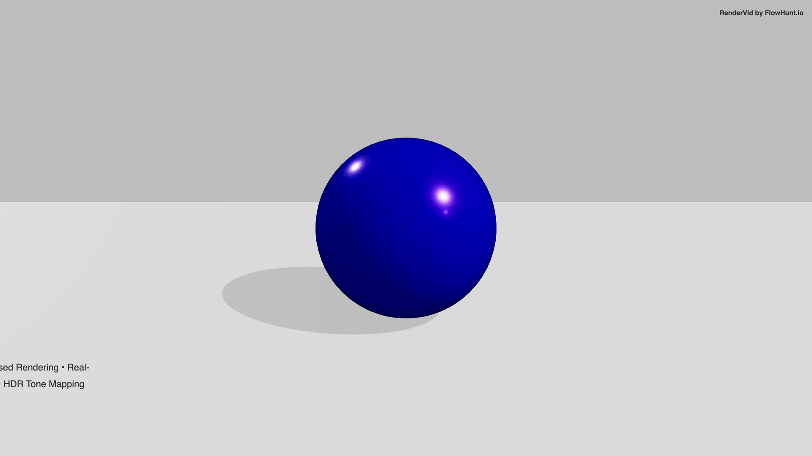

# Product Showcase

> Professional product visualization with studio lighting, shadows, and camera orbit animation.

## Preview



**[📥 Download MP4](output.mp4)**

---

## Details

| Property | Value |
|----------|-------|
| **Resolution** | 3840 × 2160 |
| **Duration** | 8s |
| **FPS** | 30 |
| **Output** | Video (MP4) |

## Inputs

| Key | Type | Default | Description |
|-----|------|---------|-------------|
| `productName` | string | `"Premium Product"` | Product Name |
| `productColor` | color | `"#4c00ff"` | Product Color |

## Usage

```bash
# Render this example
node examples/render-all.mjs "3d/product-showcase"

# Or render all examples
node examples/render-all.mjs
```

Customize inputs via the MCP server or by editing `template.json`:

```json
{
  "inputs": {
    "productName": "Premium Product",
    "productColor": "#4c00ff"
  }
}
```

---

*Part of the [RenderVid examples](../../README.md) · [RenderVid](../../../README.md)*
