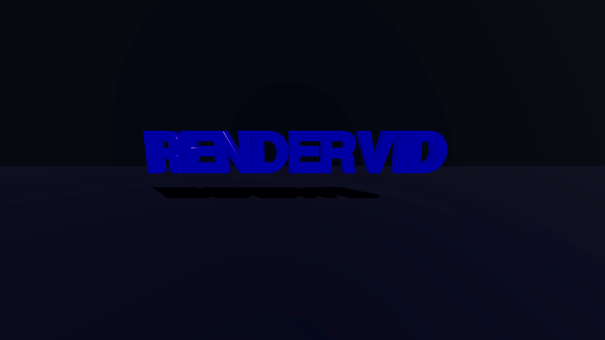

# 3D Text

Extruded 3D text with dramatic lighting, metallic material, and cinematic presentation.

## Preview



[View full video (video.mp4)](./video.mp4)

## Features

- Text3D geometry with beveled edges
- Physical material with metallic finish and clearcoat
- Five-light setup with colored accents and spotlight
- Real-time soft shadows
- Atmospheric fog
- Auto-rotation animation
- Decorative particle overlays

## Usage

```bash
pnpm run examples:render 3d/text-3d
```

With custom text:

```bash
pnpm run examples:render 3d/text-3d -- \
  --input text="HELLO 3D" \
  --input textColor="#ff6b6b"
```

## Template Configuration

### Inputs

| Input | Type | Default | Description |
|-------|------|---------|-------------|
| `text` | string | "RENDERVID" | Text to render in 3D |
| `textColor` | color | `#4c00ff` | Text material color |

### Three.js Scene Setup

**Camera:**
- Type: Perspective
- FOV: 75 degrees
- Position: [0, 2, 12]
- Looking at: Origin

**Lighting (Five-Light Setup):**

1. **Ambient Light**
   - Base illumination (intensity: 0.3)

2. **Key Light** (Directional)
   - Main light (intensity: 2)
   - Position: [10, 10, 10]
   - Casts shadows

3. **Left Accent** (Point Light)
   - Red color (#ff6b6b)
   - High intensity (3)
   - Position: [-8, 3, 5]

4. **Right Accent** (Point Light)
   - Blue/purple color (#4c00ff)
   - High intensity (3)
   - Position: [8, 3, 5]

5. **Top Spotlight**
   - White spotlight
   - Position: [0, 10, 8]
   - Cone angle: 0.5 rad
   - Soft edges (penumbra: 0.3)

**Text3D Geometry:**
- Font: Helvetiker Bold (Three.js format)
- Size: 2 units
- Extrusion depth: 0.5 units
- Bevel enabled with 0.15 thickness
- High detail (12 curve segments, 5 bevel segments)

**Material:**
- Type: Physical (most advanced PBR)
- Metalness: 0.9 (very metallic)
- Roughness: 0.1 (very shiny)
- Clearcoat: 1 (car paint effect)
- Emissive glow matching text color

**Effects:**
- Soft shadows (PCF Soft)
- Fog for depth
- ACES tone mapping with 1.3 exposure
- Auto-rotation (0.01 rad/frame on Y-axis)

## Font Requirements

This example uses a Three.js JSON format font. The template uses:
```
https://threejs.org/examples/fonts/helvetiker_bold.typeface.json
```

### Using Custom Fonts

To use your own fonts:

1. Convert TTF/OTF to Three.js JSON format using [facetype.js](http://gero3.github.io/facetype.js/)

2. Host the JSON file or use a local path:
   ```json
   "font": "./assets/my-custom-font.json"
   ```

### Available Three.js Fonts

Three.js provides several fonts in their examples:
- `helvetiker_regular.typeface.json`
- `helvetiker_bold.typeface.json`
- `optimer_regular.typeface.json`
- `optimer_bold.typeface.json`
- `gentilis_regular.typeface.json`
- `gentilis_bold.typeface.json`

All available at: `https://threejs.org/examples/fonts/`

## Customization Ideas

### Different Material Styles

**Glass effect:**
```json
"material": {
  "type": "physical",
  "color": "#ffffff",
  "metalness": 0,
  "roughness": 0,
  "transmission": 1,
  "thickness": 0.5
}
```

**Neon glow:**
```json
"material": {
  "type": "basic",
  "color": "#ff00ff",
  "emissive": "#ff00ff",
  "emissiveIntensity": 2
}
```

**Chrome:**
```json
"material": {
  "type": "physical",
  "color": "#ffffff",
  "metalness": 1,
  "roughness": 0.05
}
```

**Matte:**
```json
"material": {
  "type": "standard",
  "color": "#4c00ff",
  "metalness": 0,
  "roughness": 0.9
}
```

### Text Geometry Options

**Deeper extrusion:**
```json
"height": 1.0  // Instead of 0.5
```

**More dramatic bevel:**
```json
"bevelThickness": 0.3,
"bevelSize": 0.2
```

**Smoother curves:**
```json
"curveSegments": 24  // Instead of 12
```

**Flat text (no bevel):**
```json
"bevelEnabled": false
```

### Animation Variations

**Faster rotation:**
```json
"autoRotate": [0, 0.03, 0]
```

**Multi-axis rotation:**
```json
"autoRotate": [0.01, 0.02, 0.005]
```

**Oscillating rotation:**
Use keyframe animations instead of autoRotate

### Camera Angles

**Close-up:**
```json
"camera": {
  "type": "perspective",
  "fov": 50,
  "position": [0, 0, 8]
}
```

**Side view:**
```json
"camera": {
  "type": "perspective",
  "fov": 75,
  "position": [15, 2, 0],
  "lookAt": [0, 0, 0]
}
```

**Top-down:**
```json
"camera": {
  "type": "perspective",
  "fov": 75,
  "position": [0, 15, 5],
  "lookAt": [0, 0, 0]
}
```

## Lighting Techniques

### Dramatic Lighting

The example uses a five-light setup for maximum drama:

1. **Ambient:** Prevents pure black
2. **Key directional:** Main illumination + shadows
3. **Colored accents:** Create visual interest
4. **Spotlight:** Focused top lighting

This creates:
- Strong contrast
- Colored rim lighting
- Defined shadows
- Cinematic look

### Adjusting Mood

**High-key (bright):**
```json
{ "type": "ambient", "intensity": 0.8 },
{ "type": "directional", "intensity": 1.5 }
```

**Low-key (dark):**
```json
{ "type": "ambient", "intensity": 0.1 },
{ "type": "directional", "intensity": 1 }
```

**Colorful:**
Increase accent light intensities:
```json
{ "type": "point", "intensity": 5 }
```

## Text Positioning

The text is centered using negative X position because Text3D geometry starts at origin. To center text:

1. Estimate text width
2. Set position X to -(width/2)

For "RENDERVID" at size 2:
- Approximate width: 16 units
- Position X: -8

For custom text, you may need to adjust.

## Performance Tips

1. **Reduce geometry detail:**
   ```json
   "curveSegments": 8,
   "bevelSegments": 3
   ```

2. **Simplify material:**
   Use `standard` instead of `physical`

3. **Lower shadow quality:**
   ```json
   "shadowMapSize": 1024
   ```

4. **Reduce light count:**
   Remove accent lights if not needed

5. **Disable fog:**
   Remove fog property

## Technical Details

- **Duration:** 6 seconds at 30fps (180 frames)
- **Resolution:** 1920x1080 (Full HD)
- **Font:** Helvetiker Bold (Three.js JSON format)
- **Material:** Physical PBR with clearcoat
- **Lights:** 5 (1 ambient + 1 directional + 2 point + 1 spot)
- **Shadows:** Enabled (PCF Soft, 2048x2048)
- **Fog:** Enabled
- **Tone Mapping:** ACES Filmic

## Use Cases

This template is perfect for:

- **Logo reveals** - Replace text with company name
- **Title cards** - Video intros/outros
- **Product names** - Feature highlights
- **Event titles** - Conference/webinar intros
- **Social media** - Eye-catching text posts
- **Gaming** - Level titles, achievements
- **Music videos** - Song titles, artist names

## Troubleshooting

### Text not appearing

**Check font URL:**
- Verify font JSON is accessible
- Try the default Helvetiker font first
- Check browser console for loading errors

**Adjust camera position:**
```json
"position": [0, 0, 20]  // Move camera back
```

### Text too small/large

Adjust size and camera:
```json
"size": 3,  // Larger text
"position": [0, 0, 15]  // Camera further back
```

### Text not centered

Calculate text width and adjust X position:
```json
"position": [-(estimatedWidth/2), 0, 0]
```

### Performance issues

- Reduce `curveSegments` and `bevelSegments`
- Lower shadow map size
- Remove accent lights
- Disable fog
- Use `standard` material instead of `physical`

## Related Examples

- [Basic Rotating Cube](/examples/3d/basic-rotating-cube/) - Simple Three.js intro
- [Product Showcase](/examples/3d/product-showcase/) - Studio lighting
- [Multi-Object Scene](/examples/3d/multi-object-scene/) - Multiple objects

## Font Resources

### Online Converters
- [facetype.js](http://gero3.github.io/facetype.js/) - Convert fonts to Three.js format

### Font Libraries
- [Google Fonts](https://fonts.google.com/) - Free fonts
- [Font Squirrel](https://www.fontsquirrel.com/) - Free commercial fonts
- [DaFont](https://www.dafont.com/) - Free fonts

### Three.js Font Examples
Browse: https://threejs.org/examples/?q=font
