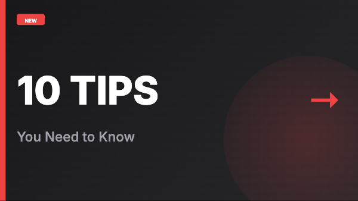

# Rendervid Examples

This directory contains runnable examples demonstrating how to create videos and images with Rendervid.

## Quick Start

```bash
# Install dependencies
pnpm install

# List all available examples
pnpm run examples:list

# Render a specific example
pnpm run examples:render getting-started/01-hello-world

# Render with custom output path
pnpm run examples:render instagram-story --output ./my-story.mp4
```

## Example Categories

### Getting Started
Simple examples to learn the basics:

| Preview | Example | Description | Output |
|---------|---------|-------------|--------|
|  | [01-hello-world](./getting-started/01-hello-world/) | Minimal text animation | Video |
|  | [02-first-video](./getting-started/02-first-video/) | Simple 5-second video with text | Video |
|  | [03-first-image](./getting-started/03-first-image/) | Social media image generator | Image |
|  | [04-image-slideshow](./getting-started/04-image-slideshow/) | Slideshow with fade transitions | Video |

### Social Media
Ready-to-use templates for social platforms:

| Preview | Example | Dimensions | Platform |
|---------|---------|------------|----------|
|  | [instagram-story](./social-media/instagram-story/) | 1080x1920 (9:16) | Instagram Stories |
|  | [instagram-post](./social-media/instagram-post/) | 1080x1080 (1:1) | Instagram Feed |
|  | [youtube-thumbnail](./social-media/youtube-thumbnail/) | 1280x720 (16:9) | YouTube |
|  | [tiktok-video](./social-media/tiktok-video/) | 1080x1920 (9:16) | TikTok |
|  | [twitter-card](./social-media/twitter-card/) | 1200x630 | Twitter/X |
|  | [linkedin-banner](./social-media/linkedin-banner/) | 1584x396 | LinkedIn |

### Marketing
Templates for marketing and promotional content:

| Preview | Example | Description | Output |
|---------|---------|-------------|--------|
|  | [product-showcase](./marketing/product-showcase/) | Feature product with details | Video |
|  | [sale-announcement](./marketing/sale-announcement/) | Promotional sale video | Video |
|  | [testimonial-video](./marketing/testimonial-video/) | Customer testimonial | Video |
|  | [before-after](./marketing/before-after/) | Before/after comparison | Video |
|  | [logo-reveal](./marketing/logo-reveal/) | Animated logo reveal | Video |
|  | [pricing-table](./marketing/pricing-table/) | 3-tier pricing comparison | Video |

### Data Visualization
Animated data visualizations:

| Preview | Example | Description | Output |
|---------|---------|-------------|--------|
|  | [animated-bar-chart](./data-visualization/animated-bar-chart/) | Animated bar chart | Video |
|  | [line-graph](./data-visualization/line-graph/) | Animated line graph | Video |
|  | [pie-chart](./data-visualization/pie-chart/) | Pie chart reveal | Video |
|  | [counter-animation](./data-visualization/counter-animation/) | Counting numbers | Video |
|  | [progress-dashboard](./data-visualization/progress-dashboard/) | Progress indicators | Video |

### Advanced
Advanced animation techniques:

| Preview | Example | Description | Output |
|---------|---------|-------------|--------|
|  | [parallax-effect](./advanced/parallax-effect/) | Multi-layer depth illusion | Video |
|  | [kinetic-typography](./advanced/kinetic-typography/) | Dynamic text animations | Video |

### E-commerce
Templates for online stores and sales:

| Preview | Example | Description | Output |
|---------|---------|-------------|--------|
|  | [flash-sale](./ecommerce/flash-sale/) | Urgency countdown sale | Video |
|  | [product-launch](./ecommerce/product-launch/) | New product announcement | Video |
|  | [product-comparison](./ecommerce/product-comparison/) | Side-by-side comparison | Video |
|  | [discount-reveal](./ecommerce/discount-reveal/) | Promo code reveal | Video |

### Events
Templates for event announcements:

| Preview | Example | Description | Output |
|---------|---------|-------------|--------|
|  | [event-countdown](./events/event-countdown/) | Days/hours/minutes countdown | Video |
|  | [save-the-date](./events/save-the-date/) | Elegant invitation style | Video |
|  | [webinar-promo](./events/webinar-promo/) | Speaker + topic + date | Video |
|  | [conference-intro](./events/conference-intro/) | Speaker introduction card | Video |

### Content Creation
Templates for content creators:

| Preview | Example | Description | Output |
|---------|---------|-------------|--------|
|  | [podcast-teaser](./content/podcast-teaser/) | Episode preview with waveform | Video |
|  | [blog-promo](./content/blog-promo/) | Blog post promotion | Video |
|  | [quote-card](./content/quote-card/) | Inspirational quote design | Video |
|  | [news-headline](./content/news-headline/) | Breaking news style | Video |

### Education
Templates for educational content:

| Preview | Example | Description | Output |
|---------|---------|-------------|--------|
|  | [course-intro](./education/course-intro/) | Course title + instructor | Video |
|  | [lesson-title](./education/lesson-title/) | Chapter/lesson title card | Video |
|  | [certificate](./education/certificate/) | Achievement certificate | Video |

### Real Estate
Templates for property listings:

| Preview | Example | Description | Output |
|---------|---------|-------------|--------|
|  | [property-listing](./real-estate/property-listing/) | Property details card | Video |
|  | [price-drop](./real-estate/price-drop/) | Price reduction alert | Video |
|  | [open-house](./real-estate/open-house/) | Open house announcement | Video |

### Streaming
Templates for streamers and gamers:

| Preview | Example | Description | Output |
|---------|---------|-------------|--------|
|  | [stream-starting](./streaming/stream-starting/) | "Starting Soon" screen | Video |
|  | [end-screen](./streaming/end-screen/) | Subscribe/follow CTA | Video |
|  | [highlight-intro](./streaming/highlight-intro/) | Game highlight intro | Video |

### Fitness
Templates for fitness content:

| Preview | Example | Description | Output |
|---------|---------|-------------|--------|
|  | [workout-timer](./fitness/workout-timer/) | Exercise interval timer | Video |
|  | [progress-tracker](./fitness/progress-tracker/) | Weekly/monthly progress | Video |

### Food & Restaurant
Templates for restaurants and food content:

| Preview | Example | Description | Output |
|---------|---------|-------------|--------|
|  | [menu-item](./food/menu-item/) | Dish showcase with price | Video |
|  | [daily-special](./food/daily-special/) | Today's special promotion | Video |
|  | [recipe-card](./food/recipe-card/) | Recipe title card | Video |

## CLI Commands

### List Examples
```bash
pnpm run examples:list
```
Shows all available examples with descriptions.

### Preview Example
```bash
pnpm run examples:preview <example-path>
```
Opens a live preview in your browser.

### Render Example
```bash
pnpm run examples:render <example-path> [options]

Options:
  --output, -o    Output file path (default: ./output/<example-name>.<ext>)
  --format, -f    Output format: mp4, webm, gif (default: mp4)
  --quality, -q   Quality: low, medium, high (default: high)
```

### Generate All Previews
```bash
pnpm run examples:generate-previews
```
Regenerates all preview GIFs and thumbnails (used in CI).

## Template Structure

Each example follows this structure:

```
example-name/
├── README.md           # Tutorial and documentation
├── template.json       # The Rendervid template
├── preview.gif         # Animated preview for videos (auto-generated)
├── preview.png         # Static preview for images (auto-generated)
└── assets/             # Optional: SVG images, fonts, etc.
    └── icon.svg
```

## Creating Your Own Examples

1. Create a new directory under the appropriate category
2. Create a `template.json` with your Rendervid template
3. Create a `render.ts` script for rendering
4. Add a `README.md` with documentation
5. Run `pnpm run examples:generate-previews` to create preview assets

## Template JSON Format

```json
{
  "name": "My Template",
  "output": {
    "type": "video",
    "width": 1920,
    "height": 1080,
    "fps": 30,
    "duration": 5
  },
  "inputs": [
    {
      "key": "title",
      "type": "string",
      "label": "Title",
      "description": "Main headline text",
      "required": true,
      "default": "Hello World"
    }
  ],
  "composition": {
    "scenes": [
      {
        "id": "main",
        "startFrame": 0,
        "endFrame": 150,
        "layers": [
          {
            "id": "title",
            "type": "text",
            "position": { "x": 960, "y": 540 },
            "size": { "width": 800, "height": 100 },
            "props": {
              "text": "{{title}}",
              "fontSize": 72,
              "fontWeight": "bold",
              "color": "#FFFFFF",
              "textAlign": "center"
            },
            "animations": [
              {
                "type": "entrance",
                "effect": "fadeIn",
                "delay": 0,
                "duration": 30
              }
            ]
          }
        ]
      }
    ]
  }
}
```

## Learn More

- [Rendervid Documentation](../README.md)
- [Template Reference](../packages/core/README.md)
- [Animation Presets](../packages/core/src/animation/presets.ts)
- [Theme System](../packages/templates/src/themes/)
