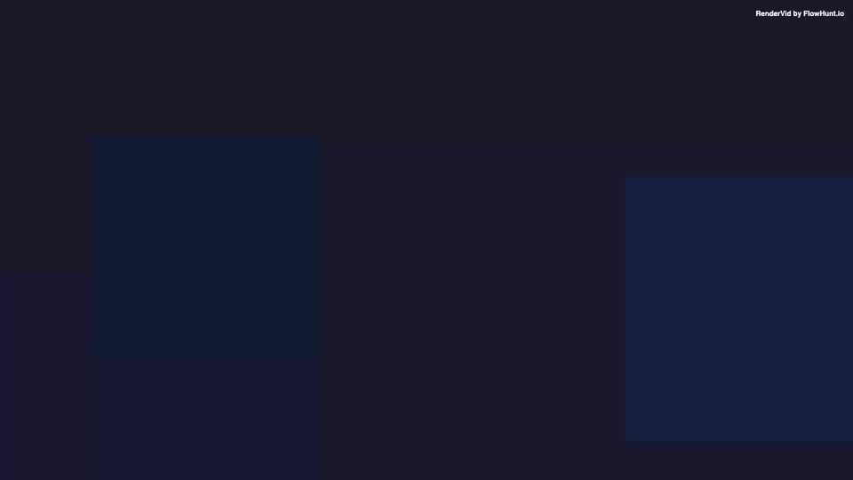

# Parallax Effect

Multi-layer composition with different animation speeds creating a stunning depth illusion.

## Preview



## Features

- Background, midground, and foreground layers
- Each layer animates at different speeds
- Creates cinematic depth illusion
- Customizable text and colors

## Usage

```bash
pnpm run examples:render advanced/parallax-effect
```

## Inputs

| Input | Type | Required | Default |
|-------|------|----------|---------|
| `title` | string | Yes | DISCOVER MORE |
| `subtitle` | string | No | Experience the depth of motion |
| `ctaText` | string | No | Learn More Today |
| `accentColor` | color | No | #e94560 |
