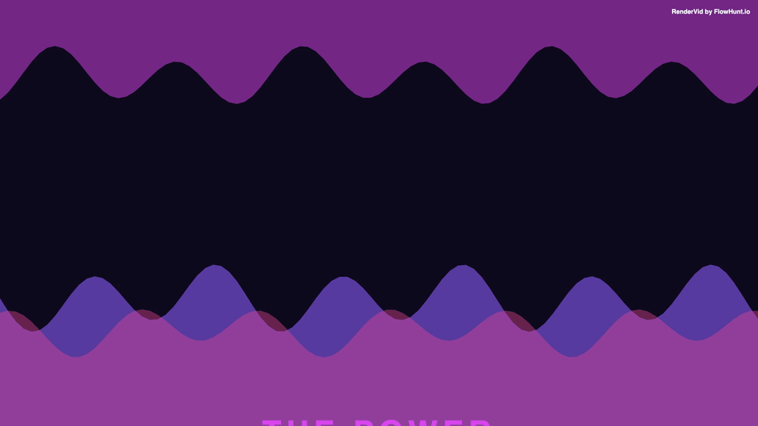

# Wave Energy

> High-energy wave background with vibrant purple/pink colors and waves from both top and bottom. Perfect for tech, gaming, and energetic content.

## Preview



**[📥 Download MP4](output.mp4)**

---

## Details

| Property | Value |
|----------|-------|
| **Resolution** | 1920 × 1080 |
| **Duration** | 5s |
| **FPS** | 30 |
| **Output** | Video (MP4) |
| **Custom Components** | WaveBackground |

## Inputs

| Key | Type | Default | Description |
|-----|------|---------|-------------|
| `title` | string | `"UNLEASH"` | Main Title (First Line) *(required)* |
| `subtitle` | string | `"THE POWER"` | Subtitle (Second Line) *(required)* |
| `tagline` | string | `"Next Generation Technology"` | Tagline |
| `waveColors` | array | `["#8b5cf6","#d946ef","#ec4899"]` | Wave Colors |
| `waveSpeed` | number | `0.8` | Wave Speed |
| `waveCount` | number | `3` | Wave Count |
| `amplitude` | number | `70` | Wave Amplitude |

## Usage

```bash
# Render this example
node examples/render-all.mjs "backgrounds/wave-energy"

# Or render all examples
node examples/render-all.mjs
```

Customize inputs via the MCP server or by editing `template.json`:

```json
{
  "inputs": {
    "title": "UNLEASH",
    "subtitle": "THE POWER",
    "tagline": "Next Generation Technology"
  }
}
```

---

*Part of the [RenderVid examples](../../README.md) · [RenderVid](../../../README.md)*
