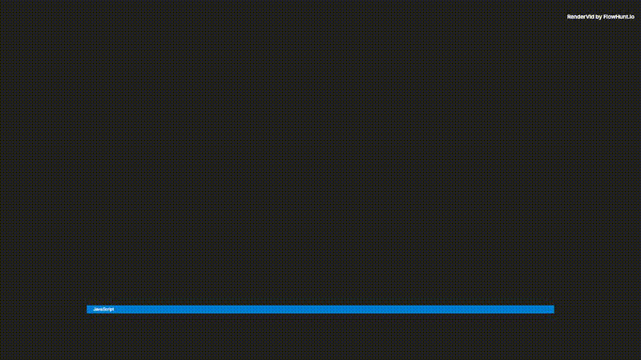

# Typewriter Code

> Code typing effect with VS Code-style dark theme and matrix-style green cursor.

## Preview



**[📥 Download MP4](output.mp4)**

---

## Details

| Property | Value |
|----------|-------|
| **Resolution** | 1920 × 1080 |
| **Duration** | 8s |
| **FPS** | 30 |
| **Output** | Video (MP4) |

## Inputs

| Key | Type | Default | Description |
|-----|------|---------|-------------|
| `codeLine1` | string | `"function calculateSum(a, b) {"` | Code Line 1 *(required)* |
| `codeLine2` | string | `"  return a + b;"` | Code Line 2 *(required)* |
| `codeLine3` | string | `"}"` | Code Line 3 *(required)* |
| `codeLine4` | string | `"console.log(calculateSum(5, 3));"` | Code Line 4 *(required)* |
| `title` | string | `"main.js"` | Title |
| `cursorColor` | color | `"#00ff41"` | Cursor Color |

## Usage

```bash
# Render this example
node examples/render-all.mjs "effects/typewriter-code"

# Or render all examples
node examples/render-all.mjs
```

Customize inputs via the MCP server or by editing `template.json`:

```json
{
  "inputs": {
    "codeLine1": "function calculateSum(a, b) {",
    "codeLine2": "  return a + b;",
    "codeLine3": "}"
  }
}
```

---

*Part of the [RenderVid examples](../../README.md) · [RenderVid](../../../README.md)*
