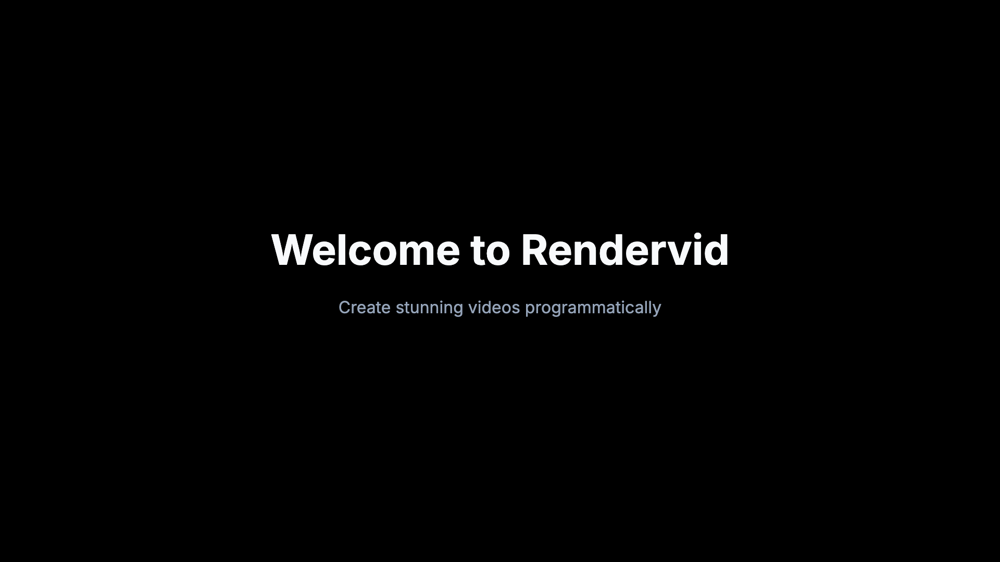

# First Video

A complete 5-second video with title, subtitle, and professional animations.

## Preview



## Description

This example creates a polished intro video with gradient backgrounds, animated text, and decorative accent elements. It demonstrates multiple layer types and staggered animations.

## Features

- 16:9 aspect ratio (1920x1080)
- Gradient background
- Staggered entrance animations
- Decorative accent elements
- Professional typography

## Inputs

| Key | Type | Required | Default | Description |
|-----|------|----------|---------|-------------|
| `title` | string | Yes | "Welcome to Rendervid" | Main headline text |
| `subtitle` | string | No | "Create stunning videos..." | Supporting text |
| `primaryColor` | color | No | #3b82f6 | Accent color |
| `backgroundColor` | color | No | #0f172a | Background color |

## Quick Start

```bash
# Render with defaults
pnpm run examples:render getting-started/02-first-video

# Render with custom text
pnpm run examples:render getting-started/02-first-video \
  --input.title "My Project" \
  --input.subtitle "Built with Rendervid"
```

## Output

- **Format**: MP4 video
- **Resolution**: 1920x1080 (Full HD)
- **Frame Rate**: 30 fps
- **Duration**: 5 seconds

## Animation Timeline

| Time | Element | Animation |
|------|---------|-----------|
| 0.0s | Top accent line | Slides in from left |
| 0.3s | Decorative circle | Scales in with bounce |
| 0.5s | Title | Slides up |
| 1.2s | Subtitle | Fades in |
| 1.7s | Bottom accent line | Scales in |

## Layer Structure

```
Layers (bottom to top):
├── background      → Gradient rectangle
├── accent-line-top → Colored line at top
├── accent-circle   → Decorative circle (low opacity)
├── title           → Main headline
├── subtitle        → Supporting text
└── accent-line-bottom → Decorative underline
```

## Key Concepts Demonstrated

### 1. Gradient Backgrounds

```json
"gradient": {
  "type": "linear",
  "colors": [
    { "offset": 0, "color": "#0f172a" },
    { "offset": 1, "color": "#1e293b" }
  ],
  "angle": 135
}
```

### 2. Staggered Animations

Each layer has a different `delay` value to create a cascading effect:

```json
"animations": [
  { "type": "entrance", "effect": "slideInUp", "delay": 15, "duration": 25 }
]
```

### 3. Decorative Elements

Low-opacity shapes add visual interest without distracting:

```json
{
  "id": "accent-circle",
  "type": "shape",
  "opacity": 0.1,
  "props": { "shape": "ellipse", "fill": "#3b82f6" }
}
```

## Next Steps

- Try [03-first-image](../03-first-image/) for static image generation
- Explore [social media templates](../../social-media/) for platform-specific formats
- Learn about [scene transitions](../../../packages/core/src/types/scene.ts)
