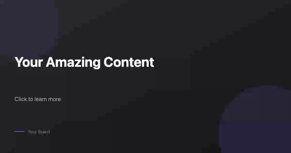

# First Image

Generate a social media image with text overlay - perfect for thumbnails, blog headers, and social posts.

## Preview




## Description

This example generates a static image optimized for social media sharing. It uses the Open Graph dimensions (1200x630) which work well across Twitter, Facebook, LinkedIn, and more.

## Features

- Open Graph dimensions (1200x630)
- Gradient background
- Professional typography
- Brand watermark
- Optimized for social sharing

## Inputs

| Key | Type | Required | Default | Description |
|-----|------|----------|---------|-------------|
| `headline` | string | Yes | "Your Amazing Content" | Main text |
| `tagline` | string | No | "Click to learn more" | Supporting text |
| `brandName` | string | No | "Your Brand" | Brand/author name |
| `primaryColor` | color | No | #8b5cf6 | Accent color |
| `backgroundColor` | color | No | #18181b | Background color |

## Quick Start

```bash
# Render with defaults
pnpm run examples:render getting-started/03-first-image

# Render with custom content
pnpm run examples:render getting-started/03-first-image \
  --input.headline "10 Tips for Better Code" \
  --input.tagline "A developer's guide" \
  --input.brandName "DevBlog"

# Output as PNG
pnpm run examples:render getting-started/03-first-image \
  --output ./thumbnail.png
```

## Output

- **Format**: PNG image
- **Resolution**: 1200x630
- **Use Cases**:
  - Twitter/X cards
  - Facebook Open Graph
  - LinkedIn posts
  - Blog thumbnails
  - YouTube thumbnails (with resize)

## Image vs Video Templates

The key difference is in the `output` configuration:

```json
// Image template
"output": {
  "type": "image",
  "width": 1200,
  "height": 630
}

// Video template
"output": {
  "type": "video",
  "width": 1920,
  "height": 1080,
  "fps": 30,
  "duration": 5
}
```

For images:
- No `fps` or `duration` needed
- Scene only needs 1 frame (`endFrame: 1`)
- No animations required (but you can include them for preview)

## Layer Structure

```
Layers (bottom to top):
├── background     → Gradient rectangle
├── accent-blob    → Decorative circle (corner)
├── accent-blob-2  → Second decorative circle
├── headline       → Main text
├── tagline        → Supporting text
├── brand-line     → Colored accent line
└── brand-name     → Brand watermark
```

## Common Dimensions

| Platform | Dimensions | Aspect Ratio |
|----------|------------|--------------|
| Open Graph | 1200x630 | 1.91:1 |
| Twitter Card | 1200x628 | 1.91:1 |
| Instagram Post | 1080x1080 | 1:1 |
| Instagram Story | 1080x1920 | 9:16 |
| YouTube Thumbnail | 1280x720 | 16:9 |
| LinkedIn Banner | 1584x396 | 4:1 |

## Next Steps

- Try [social-media templates](../../social-media/) for platform-specific formats
- Learn about [image optimization](../../../packages/renderer-node/)
- Explore [marketing templates](../../marketing/) for promotional content
