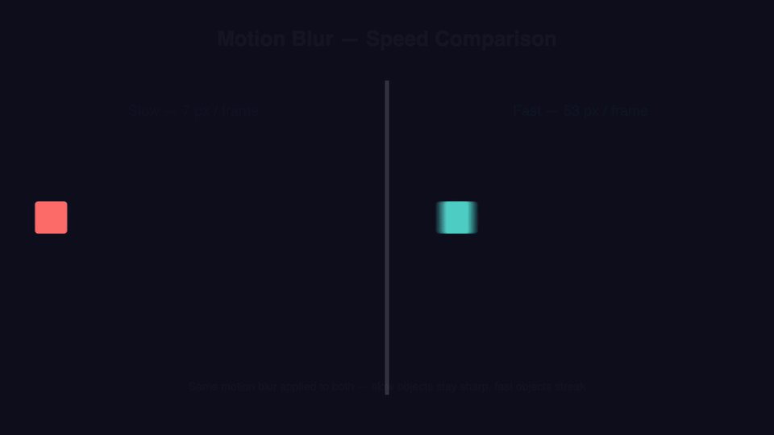
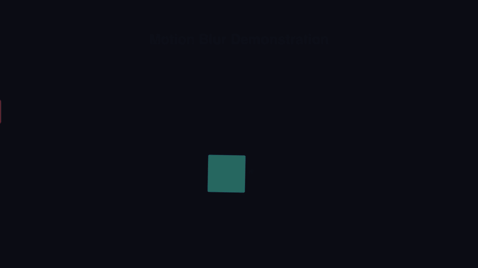
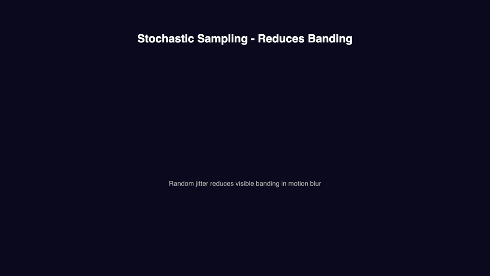
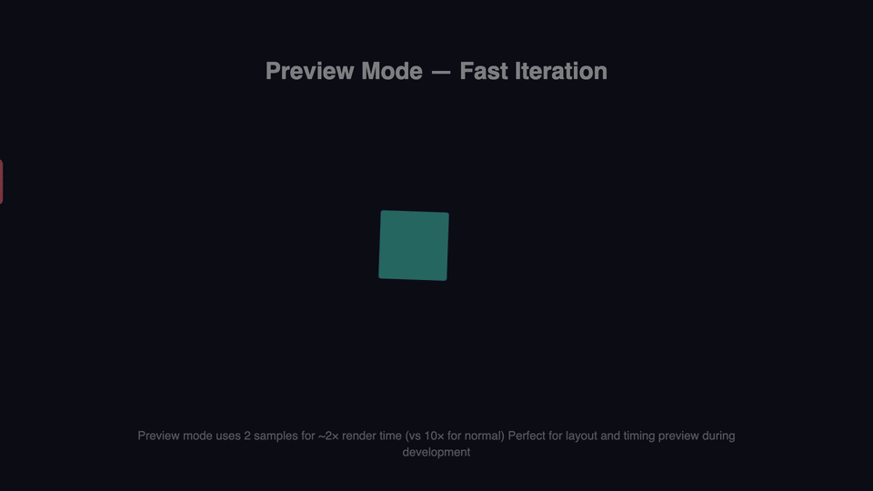

# Motion Blur Examples

This directory contains comprehensive examples demonstrating cinematic motion blur for video rendering. Motion blur simulates the natural blur that occurs when objects move quickly in front of a camera, creating more realistic and professional-looking animations.


*Side-by-side comparison: without blur (left) vs with motion blur (right)*

## Overview

Motion blur is achieved through **temporal supersampling**: rendering multiple sub-frames at fractional time offsets for each output frame, then compositing them with weighted averaging. This creates smooth, realistic motion blur that matches professional camera equipment.

### Quick Visual Comparison

| Without Motion Blur | With Motion Blur |
|---------------------|------------------|
|  |  |
| Sharp, strobing motion | Smooth, cinematic motion |

## When to Use Motion Blur

✅ **Best for:**
- Fast-moving animations
- Camera pans and transitions
- Product showcases with rotation
- Sports/action content
- Professional/cinematic videos

❌ **Avoid for:**
- Static text and images
- Very long videos (use async rendering)
- Simple graphics without motion
- When render time is critical

## Example Templates

This directory contains 5 comprehensive example templates, each with:
- ✅ JSON template
- ✅ Rendered MP4 video
- ✅ Animated GIF for preview
- ✅ Still frame preview

### 1. Basic Motion Blur (`basic.json`)


Simple demonstration of motion blur with moving shapes:
- Fast-moving rectangle (linear motion)
- Rotating square (circular motion)
- Multiple animation types

**Settings:** Medium quality (10 samples), 3 seconds
**Use case:** Understanding basic motion blur effect

**Files:**
- `basic.json` - Template
- `basic.mp4` - Rendered video (with blur)
- `basic.gif` - Animated preview
- `basic-preview.png` - Still frame

---

### 2. Without Motion Blur Comparison (`basic-no-blur`)


Same animation as basic example but **without motion blur** for comparison:
- Shows strobing effect on fast motion
- Demonstrates why motion blur is important
- Side-by-side comparison material

**Settings:** Motion blur disabled, 3 seconds
**Use case:** Visual comparison, understanding the difference

**Files:**
- Uses `basic.json` template
- `basic-no-blur.mp4` - Rendered video (no blur)
- `basic-no-blur.gif` - Animated preview
- `basic-no-blur-preview.png` - Still frame

---

### 3. Side-by-Side Comparison (`comparison.json`)


Split-screen showing both versions simultaneously:
- Left side: No motion blur (sharp, strobing)
- Right side: With motion blur (smooth, cinematic)
- Same motion on both sides for direct comparison

**Settings:** High quality (16 samples), 4 seconds
**Use case:** Documentation, presentations, client demos

**Files:**
- `comparison.json` - Template
- `comparison.mp4` - Rendered video
- `comparison.gif` - Animated preview
- `comparison-preview.png` - Still frame

---

### 4. Advanced Features (`advanced.json`)



Showcases all advanced motion blur features:
- **Scene 1:** Stochastic sampling (reduces banding)
- **Scene 2:** Variable sample rate (auto-optimization)
- **Scene 3:** Blur amount control (0.5×, 1.0×, 1.8×)
- **Scene 4:** Blur axis control (x-only, both)

**Settings:** High quality with stochastic, 8 seconds
**Use case:** Learning advanced features, quality comparisons

**Files:**
- `advanced.json` - Template
- `advanced.mp4` - Rendered video
- `advanced.gif` - Animated preview
- `advanced-preview.png` - Still frame

---

### 5. Preview Mode (`preview-mode.json`)



Fast preview mode demonstration:
- Multiple fast-moving objects
- Rotating shapes
- Uses only 2 samples (vs 10 for normal)

**Settings:** Preview mode (2 samples), 3 seconds
**Use case:** Fast iteration during development (~2× render time vs 10×)

**Files:**
- `preview-mode.json` - Template
- `preview-mode.mp4` - Rendered video
- `preview-mode.gif` - Animated preview
- `preview-mode-preview.png` - Still frame

## 🎬 How to Render Examples

### Option 1: Render All Examples (Recommended)

From the examples/motion-blur directory:

```bash
node render-all.mjs
```

This will:
- ✅ Render all 5 templates to MP4 videos
- ✅ Create animated GIFs for each video
- ✅ Extract preview frames (PNG)
- ✅ Show detailed progress and timing

**Expected time:** ~35-40 minutes total (on M3 Max)

**Output:** 15 files total (5× MP4 + 5× GIF + 5× PNG)

---

### Option 2: Quick Preview (Fast)

Render just the preview-mode example (fastest):

```bash
# From project root
cd examples/motion-blur
node -e "
import { createNodeRenderer } from '@rendervid/renderer-node';
import { readFileSync } from 'fs';

const template = JSON.parse(readFileSync('./preview-mode.json', 'utf-8'));
const renderer = createNodeRenderer();

await renderer.renderVideo({
  template,
  outputPath: './preview-mode.mp4',
  motionBlur: { enabled: true, preview: true }
});
"
```

**Time:** ~1 minute

---

### Option 3: Individual Example

Using Node.js:

```javascript
import { createNodeRenderer } from '@rendervid/renderer-node';
import { readFileSync } from 'fs';

const template = JSON.parse(readFileSync('./basic.json', 'utf-8'));
const renderer = createNodeRenderer();

await renderer.renderVideo({
  template,
  outputPath: './basic.mp4',
  hardwareAcceleration: { enabled: false },
  bitrate: '8M',
  preset: 'medium',
  motionBlur: {
    enabled: true,
    quality: 'medium'  // 10 samples
  }
});
```

---

### Option 4: Using MCP Server

```json
{
  "template": { /* paste basic.json content here */ },
  "outputPath": "~/Downloads/basic.mp4",
  "motionBlur": {
    "enabled": true,
    "quality": "medium"
  }
}
```

---

## 🎨 Generate GIFs & Previews

### Automatic (Included in render-all.mjs)

The `render-all.mjs` script automatically creates GIFs and preview frames.

### Manual GIF Generation

If you already have MP4 files:

```bash
./generate-previews.sh
```

Or manually with FFmpeg:

```bash
# Create optimized animated GIF (15fps, 960px wide)
ffmpeg -i basic.mp4 \
  -vf "fps=15,scale=960:-1:flags=lanczos,split[s0][s1];[s0]palettegen[p];[s1][p]paletteuse" \
  -loop 0 basic.gif

# Extract preview frame (middle of video)
ffmpeg -i basic.mp4 -vf "select=eq(n\,45)" -vframes 1 basic-preview.png
```

---

## ⏱️ Render Times (Approximate)

On Apple M3 Max, 1920×1080, 30fps:

| Example | Duration | Samples | Render Time | File Size |
|---------|----------|---------|-------------|-----------|
| preview-mode | 3s | 2 (preview) | ~1 min | ~2 MB |
| basic-no-blur | 3s | 0 (disabled) | ~30 sec | ~2 MB |
| basic | 3s | 10 (medium) | ~5 min | ~2 MB |
| comparison | 4s | 16 (high) | ~10 min | ~3 MB |
| advanced | 8s | 16 (high+stoch) | ~20 min | ~6 MB |
| **Total** | **21s** | **Mixed** | **~37 min** | **~15 MB** |

**GIF sizes:** ~3-8 MB each (optimized, 15fps)

## How to Render

### Using the MCP Server

```javascript
{
  "template": { /* your template */ },
  "outputPath": "~/Downloads/motion-blur-demo.mp4",
  "motionBlur": {
    "enabled": true,
    "quality": "medium"  // 10 samples, ~10x slower
  }
}
```

### Using Node.js

```javascript
import { createNodeRenderer } from '@rendervid/renderer-node';

const renderer = createNodeRenderer();
const result = await renderer.renderVideo({
  template: yourTemplate,
  outputPath: './output.mp4',
  motionBlur: {
    enabled: true,
    quality: 'medium'
  }
});
```

## Motion Blur Configuration

### Quality Presets (Recommended)

| Quality | Samples | Render Time | Use Case |
|---------|---------|-------------|----------|
| `low` | 5 | ~5× slower | Quick previews, testing |
| `medium` | 10 | ~10× slower | Standard production (default) |
| `high` | 16 | ~16× slower | Cinematic quality |
| `ultra` | 32 | ~32× slower | Maximum smoothness |

### Simple Example

```json
{
  "motionBlur": {
    "enabled": true,
    "quality": "medium"
  }
}
```

### Advanced Configuration

```json
{
  "motionBlur": {
    "enabled": true,
    "samples": 12,              // 2-32 temporal samples
    "shutterAngle": 180,        // 0-360° (180° = cinematic standard)
    "adaptive": true,           // Auto-reduce samples on static frames
    "minSamples": 3,            // Minimum for adaptive mode
    "motionThreshold": 0.01     // Motion detection sensitivity
  }
}
```

## Configuration Hierarchy

Motion blur can be configured at three levels:

1. **Global** (entire video) - Set in `renderVideo()` options
2. **Scene** (per scene) - Set in `scene.motionBlur`
3. **Layer** (per layer) - Set in `layer.motionBlur`

**Priority:** Layer > Scene > Global

### Example: Mixed Configuration

```json
{
  "composition": {
    "scenes": [
      {
        "id": "action-scene",
        "motionBlur": { "quality": "high" },  // High quality for this scene
        "layers": [
          { "id": "hero" },  // Inherits: high quality
          {
            "id": "ui",
            "motionBlur": { "enabled": false }  // Override: disable for UI
          }
        ]
      },
      {
        "id": "title-scene",
        "motionBlur": { "enabled": false },  // Disable for static title
        "layers": [...]
      }
    ]
  }
}
```

## Parameters Explained

### Basic Parameters

#### samples
Number of sub-frames rendered per output frame. Higher values create smoother blur but increase render time linearly.
- **Range:** 2-32
- **Default:** 10
- **Recommendation:** Use quality presets instead

#### shutterAngle
Simulates camera shutter opening angle, controlling blur amount.
- **Range:** 0-360°
- **Default:** 180° (cinematic standard, half-frame exposure)
- **Examples:**
  - 360° = maximum blur (full frame)
  - 180° = natural cinematic look
  - 90° = fast shutter, minimal blur

### Performance Optimization Parameters

#### adaptive
Automatically reduces sample count on static/slow-moving frames to save render time.
- **Default:** false
- **Benefit:** 30-50% time reduction on mixed content
- **Note:** May miss subtle motion

#### minSamples
Minimum samples when adaptive mode reduces quality.
- **Range:** 2-32 (must be ≤ samples)
- **Default:** 3

#### motionThreshold
Motion detection sensitivity for adaptive mode.
- **Range:** 0.0001-1.0
- **Default:** 0.01 (1% pixel difference)
- **Lower values:** More aggressive reduction (may miss motion)
- **Higher values:** More conservative (renders more samples)

#### variableSampleRate
Auto-adjusts sample count per frame based on motion magnitude.
- **Default:** false
- **Benefit:** Optimizes samples automatically
- **Use with:** `maxSamples` to set upper bound

#### maxSamples
Maximum samples for variable sample rate mode.
- **Range:** 2-32 (must be ≥ samples)
- **Default:** samples
- **Use with:** `variableSampleRate: true`

#### preview
Ultra-fast preview mode using minimal samples (2).
- **Default:** false
- **Benefit:** ~2× render time instead of 10×
- **Use for:** Quick iteration, layout preview

### Quality Enhancement Parameters

#### stochastic
Adds random jitter to sample times to reduce banding artifacts.
- **Default:** false
- **Benefit:** More natural blur, reduced banding
- **Trade-off:** Slight temporal noise (usually imperceptible)

### Fine-Tuning Parameters

#### blurAmount
Blur amount multiplier for fine control.
- **Range:** 0-2
- **Default:** 1.0
- **Examples:**
  - 0 = no blur
  - 0.5 = half blur
  - 1.0 = normal blur
  - 1.5 = 50% more blur
  - 2.0 = double blur

#### blurAxis
Blur only on specific axis.
- **Values:** 'x' | 'y' | 'both'
- **Default:** 'both'
- **Use cases:**
  - 'x' = horizontal pan blur only
  - 'y' = vertical scroll blur only
  - 'both' = normal omnidirectional blur

## Performance Considerations

⚠️ **Render Time Impact:**
- Render time ≈ base time × sample count
- 10 samples = ~10× slower
- 5-minute base render with 10 samples = ~50 minutes

**Optimization Tips:**
1. Use **quality presets** for simplicity
2. Enable **adaptive sampling** for mixed content
3. Use **lower quality** for previews
4. Render **long videos async** to avoid timeout
5. Consider **scene-level** config (only blur action scenes)
6. **Disable for UI layers** (text, buttons)

## Visual Comparison

### No Motion Blur

Sharp, crisp frames with strobing effect on fast motion.

### With Motion Blur (10 samples)

Smooth, natural motion with cinematic quality.

## Technical Details

**Implementation:** Temporal supersampling with Sharp (libvips) compositing

**Algorithm:**
1. Calculate sub-frame times based on shutter angle
2. Render multiple frames at fractional time offsets
3. Composite with weighted averaging (equal weights)
4. Output single motion-blurred frame

**Sub-frame Calculation Example:**
```
Frame: 10
Samples: 8
Shutter Angle: 180° (0.5 fraction)
Phase: -0.5 (centered)

Sub-frame times:
9.75, 9.82, 9.89, 9.96, 10.04, 10.11, 10.18, 10.25
```

## Limitations

- ❌ **Not supported:** Custom keyframe animations with size/position changes (use standard animations: fadeIn, fadeOut, slideIn, etc.)
- ⚠️ **Video sync:** Video layers sync to ~1ms precision at sub-frames
- 💾 **Memory:** ~8MB per sample for 1920×1080 frames

## Related Examples

- `/examples/animations` - Standard animations (work with motion blur)
- `/examples/3d` - Three.js scenes (work with motion blur)
- `/examples/transitions` - Scene transitions

## Questions?

See the main Rendervid documentation or check issue #26 for technical details.
