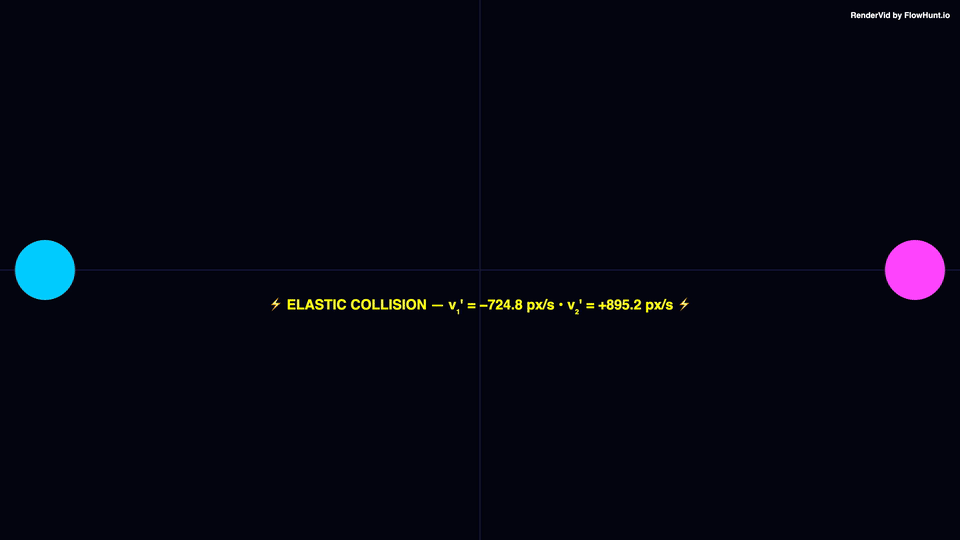

# Collision Events

> Real 2D elastic collision physics simulation — frame-by-frame equations of motion with wall bouncing.

## Preview



---

## Details

| Property | Value |
|----------|-------|
| **Resolution** | 3840 × 2160 |
| **Duration** | 8s |
| **FPS** | 30 |
| **Output** | Video (MP4) |
| **Custom Components** | CollisionPhysics |

## Usage

```bash
# Render this example
node examples/render-all.mjs "physics/collision-demo"

# Or render all examples
node examples/render-all.mjs
```

---

*Part of the [RenderVid examples](../../README.md) · [RenderVid](../../../README.md)*
