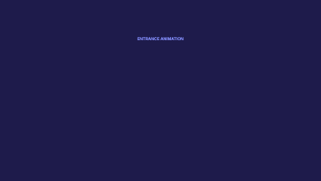

# All Animations Showcase

Demonstrates all available animation effects in Rendervid.

## Preview



## Usage

```bash
pnpm run examples:render showcase/all-animations
```

## Featured Animations

### Entrance Animations (9 shown)
| Animation | Description |
|-----------|-------------|
| fadeIn | Fade from transparent to opaque |
| scaleIn | Grow from zero to full size |
| slideInUp | Slide up from bottom |
| slideInDown | Slide down from top |
| slideInLeft | Slide in from left |
| slideInRight | Slide in from right |
| zoomIn | Zoom from 30% to 100% |
| bounceIn | Elastic bounce effect |
| rotateIn | Rotate 180° while fading in |

### Exit Animations (3 shown)
| Animation | Description |
|-----------|-------------|
| fadeOut | Fade to transparent |
| scaleOut | Shrink to zero |
| zoomOut | Zoom from 100% to 30% |

### Emphasis Animations (2 shown)
| Animation | Description |
|-----------|-------------|
| pulse | Scale up and down repeatedly |
| shake | Horizontal shaking motion |

## Additional Animations Available

- fadeInUp, fadeInDown, fadeInLeft, fadeInRight
- fadeOutUp, fadeOutDown, fadeOutLeft, fadeOutRight
- slideOutUp, slideOutDown, slideOutLeft, slideOutRight
- bounce, spin, heartbeat, float

## Duration

- 14 animations × ~2 seconds = 30 seconds total
