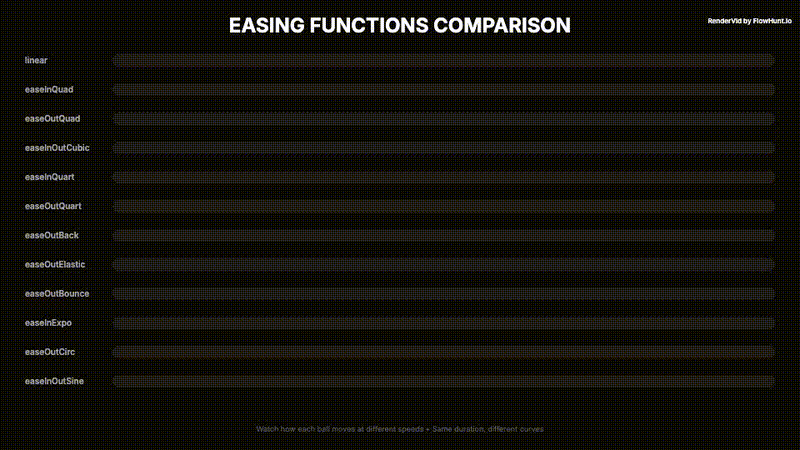

# All Easing Functions Showcase

> Side-by-side comparison of all easing functions in Rendervid.

## Preview



**[📥 Download MP4](output.mp4)**

---

## Details

| Property | Value |
|----------|-------|
| **Resolution** | 1920 × 1080 |
| **Duration** | 4s |
| **FPS** | 30 |
| **Output** | Video (MP4) |

## Usage

```bash
# Render this example
node examples/render-all.mjs "showcase/all-easing"

# Or render all examples
node examples/render-all.mjs
```

---

*Part of the [RenderVid examples](../../README.md) · [RenderVid](../../../README.md)*
