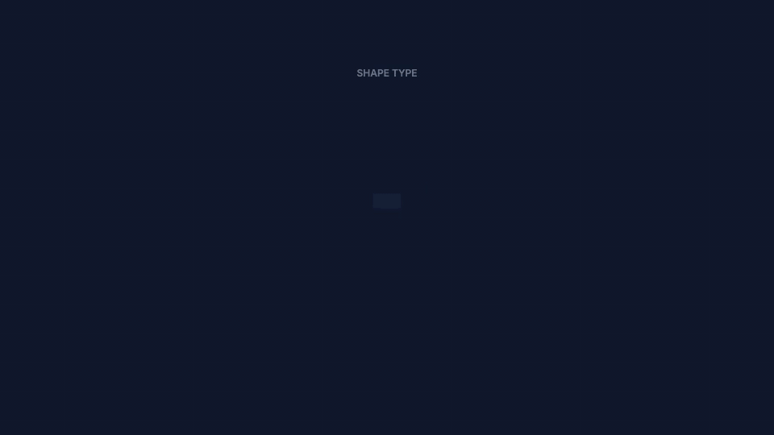

# All Shapes Showcase

Demonstrates all available shape types and gradients in Rendervid.

## Preview



[View animated SVG](preview.svg)

## Usage

```bash
pnpm run examples:render showcase/all-shapes
```

## Featured Shapes

| Shape | Description |
|-------|-------------|
| Rectangle | Basic rectangle with optional border radius |
| Rounded Rectangle | Rectangle with large border radius |
| Ellipse | Oval/elliptical shape |
| Circle | Equal width/height ellipse |

## Gradient Types

| Type | Description |
|------|-------------|
| Linear | Directional gradient with angle control |
| Radial | Center-based circular gradient |

## Shape Properties

- **fill**: Solid color fill
- **gradient**: Linear or radial gradient
- **borderRadius**: Corner rounding (rectangles)
- **stroke**: Border color and width

## Duration

- 6 shapes × 2 seconds = 12 seconds total
