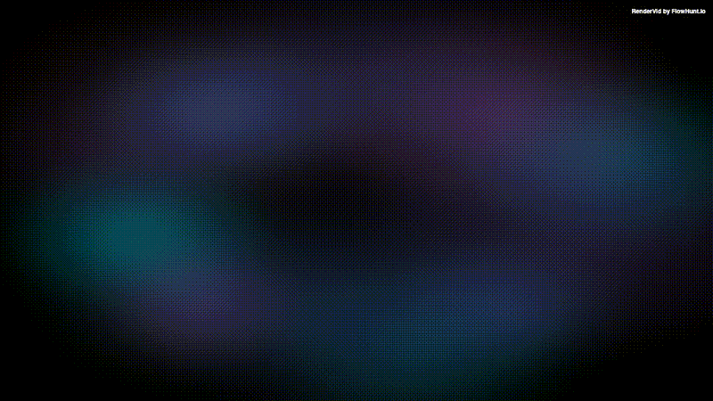

# New Components Showcase

A comprehensive 9-second showcase video demonstrating all of Rendervid's latest advanced components in one impressive composition. This template combines multiple visual effects with smooth transitions to create a professional, visually stunning demo.

## Preview



## Overview

**Duration:** 9 seconds (270 frames at 30fps)
**Resolution:** 1920x1080 (Full HD)
**Components Featured:** 8 new components

## Scene Breakdown

### Scene 1: Aurora Background + Particle System (0-45 frames, 0-1.5s)

**Visual Elements:**
- **AuroraBackground**: Flowing northern lights effect with vibrant purple, blue, and pink gradients
- **ParticleSystem**: 100 floating particles creating a dreamy atmosphere
- **Text**: "AURORA PARTICLES" with glowing shadow effect

**Color Palette:**
- Aurora colors: `#667eea`, `#764ba2`, `#f093fb`, `#4facfe`, `#00f2fe`
- Particle colors: white, purple, pink
- Text: white with blue glow

**Animations:**
- Text fades in smoothly (frames 5-25)
- Text fades out for transition (frames 35-45)

**Key Features Demonstrated:**
- Smooth aurora gradient animation
- Organic particle floating behavior
- Professional text entrance animation

---

### Scene 2: Wave Background + TypewriterEffect (45-90 frames, 1.5-3s)

**Visual Elements:**
- **WaveBackground**: Three layers of animated waves at the bottom
- **TypewriterEffect**: Code-style typing animation with cursor
- Container box with semi-transparent background

**Color Palette:**
- Wave colors: `#4facfe`, `#00f2fe`, `#43e97b` (blue to cyan gradient)
- Background: dark navy `#0a0a1f`
- Text: white with cyan cursor

**Text Content:**
```
The future is here.
Frame-perfect animations.
Built for video.
```

**Animations:**
- Container scales in with bounce effect (frames 45-60)
- Text types out character by character with sound pulse effect
- Cursor blinks when typing completes

**Key Features Demonstrated:**
- Multi-layer wave animation with different speeds
- Character-by-character typewriter effect
- Sound pulse visual feedback
- Smooth container entrance

---

### Scene 3: MetaBalls + Text (90-135 frames, 3-4.5s)

**Visual Elements:**
- **MetaBalls**: 6 morphing blobs orbiting in circular patterns
- Title and subtitle with glowing effects

**Color Palette:**
- MetaBalls: `#ff0080` (pink), `#7928ca` (purple), `#4c00ff` (blue)
- Text: white with pink/purple glow
- Background: pure black

**Animations:**
- Title fades in (frames 90-110)
- Subtitle fades in delayed (frames 100-115)
- Both fade out for transition (frames 125-135)

**Key Features Demonstrated:**
- Organic metaball merging effect
- Orbital movement pattern
- Breathing size variation
- Multi-color gradient blobs

---

### Scene 4: Glitch Effect (135-180 frames, 4.5-6s)

**Visual Elements:**
- **GlitchEffect**: RGB split distortion effect applied to all content
- "GLITCH EFFECT" text in matrix-style green
- Monospace typography for tech aesthetic

**Color Palette:**
- Text: bright green `#00ff00`
- Background: near black `#0a0a0a`

**Glitch Settings:**
- Type: RGB split
- Intensity: 0.7
- Frequency: 0.15 (glitches ~every 6 seconds)
- Duration: 120ms per glitch

**Animations:**
- Title zooms in dramatically (frames 135-150)
- Subtitle fades in (frames 145-160)
- Random glitch effects throughout

**Key Features Demonstrated:**
- RGB channel separation effect
- Deterministic glitch timing
- Integration with text layers
- Retro digital aesthetic

---

### Scene 5: ThreeScene Rotating Cube (180-225 frames, 6-7.5s)

**Visual Elements:**
- **ThreeScene**: 3D rotating cube with directional lighting
- "3D GRAPHICS" title
- "Powered by Three.js" subtitle

**Color Palette:**
- Cube: vibrant purple `#4c00ff`
- Background: dark blue-gray `#1a1a2e`
- Text: white and gray

**3D Settings:**
- Geometry: box (cube)
- Scale: 2x
- Rotation: continuous on all axes (x: 0.5, y: 1, z: 0.3)
- Camera distance: 600
- Lighting: directional

**Animations:**
- Cube scales in with bounce (frames 180-200)
- Title slides up from bottom (frames 195-215)
- Subtitle fades in (frames 205-220)

**Key Features Demonstrated:**
- 3D rendering with Three.js
- Smooth continuous rotation
- Professional lighting
- Scale entrance animation

---

### Scene 6: SVG Drawing + Finale (225-270 frames, 7.5-9s)

**Visual Elements:**
- **SVGDrawing**: Animated vector path drawing (simulated)
- "SVG DRAWING" title
- "Animated Vector Graphics" subtitle
- "RENDERVID" logo watermark

**Color Palette:**
- SVG stroke: cyan `#00ffff`
- Title: cyan with glow
- Background: dark purple-black `#1a1a1f`

**SVG Animation Settings:**
- Duration: 1.5 seconds
- Mode: oneByOne (paths draw sequentially)
- Stroke width: 3px
- Easing: ease-in-out

**Animations:**
- Title slides up (frames 230-250)
- Subtitle fades in (frames 240-255)
- Logo appears at top (frames 250-270)

**Key Features Demonstrated:**
- SVG path animation
- Sequential path drawing
- Vector graphics integration
- Professional closing scene

---

## Color Scheme Philosophy

The showcase uses a carefully crafted color progression:

1. **Scene 1**: Purple/Blue (Aurora) - Magical, dreamy
2. **Scene 2**: Cyan/Green (Waves) - Modern, fresh
3. **Scene 3**: Pink/Purple (MetaBalls) - Bold, energetic
4. **Scene 4**: Green (Glitch) - Retro, technical
5. **Scene 5**: Purple/White (3D) - Professional, clean
6. **Scene 6**: Cyan (SVG) - Technical, modern

This creates a cohesive visual journey while showcasing each component's unique capabilities.

## Transitions

Scene transitions are designed to be smooth and professional:

- **1→2**: Fade out text + cut to new scene
- **2→3**: Direct cut (dark backgrounds blend)
- **3→4**: Fade out + cut to black
- **4→5**: Direct cut with zoom entrance
- **5→6**: Direct cut with slide entrance

## Technical Details

### Frame Timing
- Total duration: 270 frames @ 30fps = 9 seconds
- Scene 1: 45 frames (1.5s)
- Scene 2: 45 frames (1.5s)
- Scene 3: 45 frames (1.5s)
- Scene 4: 45 frames (1.5s)
- Scene 5: 45 frames (1.5s)
- Scene 6: 45 frames (1.5s)

### Performance Considerations
- Uses frame-based animation for deterministic rendering
- All effects are GPU-friendly
- No external assets required (except optional SVG paths)
- Optimized for video export

## Usage

### Generate the Video

```bash
# Using Rendervid CLI
rendervid render examples/showcase/new-components-showcase/template.json

# Or with custom output path
rendervid render examples/showcase/new-components-showcase/template.json -o output/showcase.mp4
```

### Customization Options

While this template has no inputs (for consistency), you can customize by editing the template.json:

1. **Change colors**: Modify color values in each scene's props
2. **Adjust timing**: Change startFrame/endFrame for each scene
3. **Modify text**: Update text content in layer props
4. **Tweak effects**: Adjust intensity, speed, blur, and other effect parameters

## Use Cases

This showcase template is perfect for:

- **Portfolio demos**: Show off Rendervid's capabilities
- **Client presentations**: Demonstrate animation possibilities
- **Documentation**: Visual reference for all new components
- **Social media**: Eye-catching promotional content
- **Learning**: Study how different components work together

## Components Used

| Component | Purpose | Scene(s) |
|-----------|---------|----------|
| AuroraBackground | Flowing gradient background | 1 |
| ParticleSystem | Floating particle effects | 1 |
| WaveBackground | Animated wave layers | 2 |
| TypewriterEffect | Text typing animation | 2 |
| MetaBalls | Morphing blob effects | 3 |
| GlitchEffect | Digital distortion | 4 |
| ThreeScene | 3D graphics rendering | 5 |
| SVGDrawing | Vector path animation | 6 |

## Learning Resources

Each component has detailed documentation:

- [AuroraBackground](/packages/components/src/backgrounds/AuroraBackground.tsx)
- [WaveBackground](/packages/components/src/backgrounds/WaveBackground.tsx)
- [ParticleSystem](/packages/components/src/effects/ParticleSystem.tsx)
- [MetaBalls](/packages/components/src/effects/MetaBalls.tsx)
- [GlitchEffect](/packages/components/src/effects/GlitchEffect.tsx)
- [ThreeScene](/packages/components/src/effects/ThreeScene.tsx)
- [SVGDrawing](/packages/components/src/effects/SVGDrawing.tsx)
- [TypewriterEffect](/packages/components/src/effects/TypewriterEffect.tsx)

## Tips for Best Results

1. **Render Quality**: Use high quality settings for final output
2. **Performance**: Pre-render with lower quality for previews
3. **Customization**: Start with this template and modify for your needs
4. **Color Consistency**: Maintain the color palette for cohesive results
5. **Timing**: Keep scene durations balanced for good pacing

## Credits

Built with [Rendervid](https://github.com/rendervid/rendervid) - The frame-perfect video generation framework.

---

**Note**: This showcase demonstrates the power of combining multiple advanced components in a single composition. Each component can also be used individually in your own projects.
