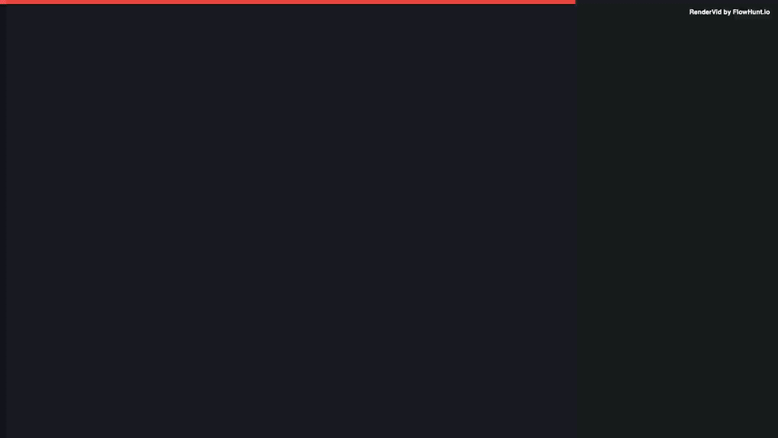

# End Screen

> Professional end screen with subscribe and follow CTAs.

## Preview



**[📥 Download MP4](output.mp4)**

---

## Details

| Property | Value |
|----------|-------|
| **Resolution** | 1920 × 1080 |
| **Duration** | 8s |
| **FPS** | 30 |
| **Output** | Video (MP4) |

## Inputs

| Key | Type | Default | Description |
|-----|------|---------|-------------|
| `thanksText` | string | `"Thanks for Watching!"` | Thanks Text *(required)* |
| `channelName` | string | `"GameMaster Pro"` | Channel Name *(required)* |
| `nextStream` | string | `"Next Stream: Saturday 8PM EST"` | Next Stream |

## Usage

```bash
# Render this example
node examples/render-all.mjs "streaming/end-screen"

# Or render all examples
node examples/render-all.mjs
```

Customize inputs via the MCP server or by editing `template.json`:

```json
{
  "inputs": {
    "thanksText": "Thanks for Watching!",
    "channelName": "GameMaster Pro",
    "nextStream": "Next Stream: Saturday 8PM EST"
  }
}
```

---

*Part of the [RenderVid examples](../../README.md) · [RenderVid](../../../README.md)*
